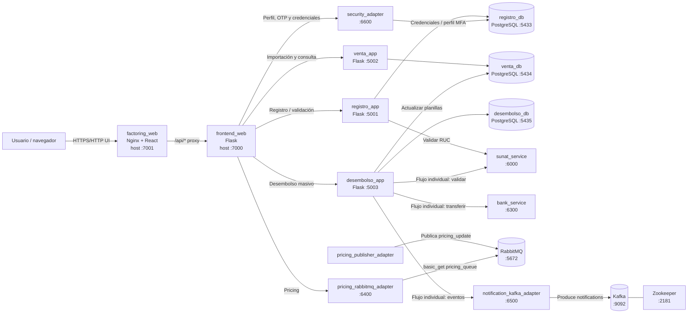
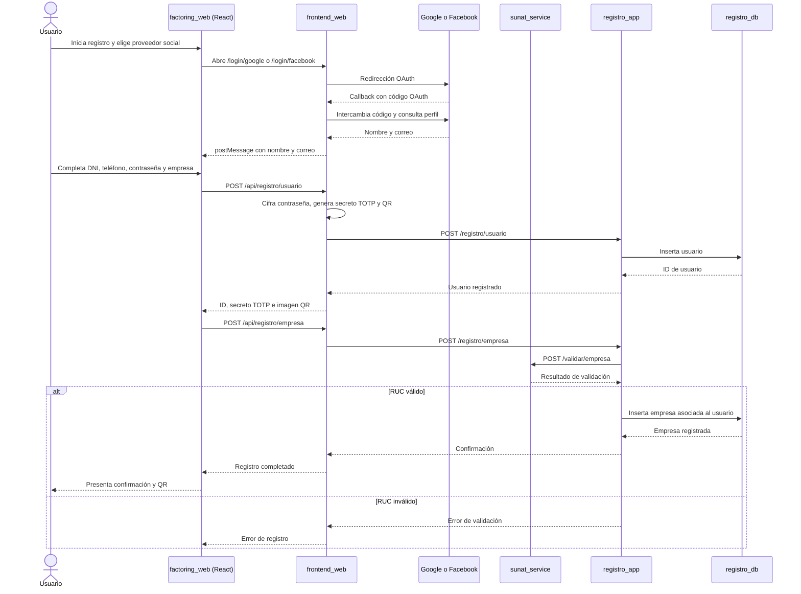
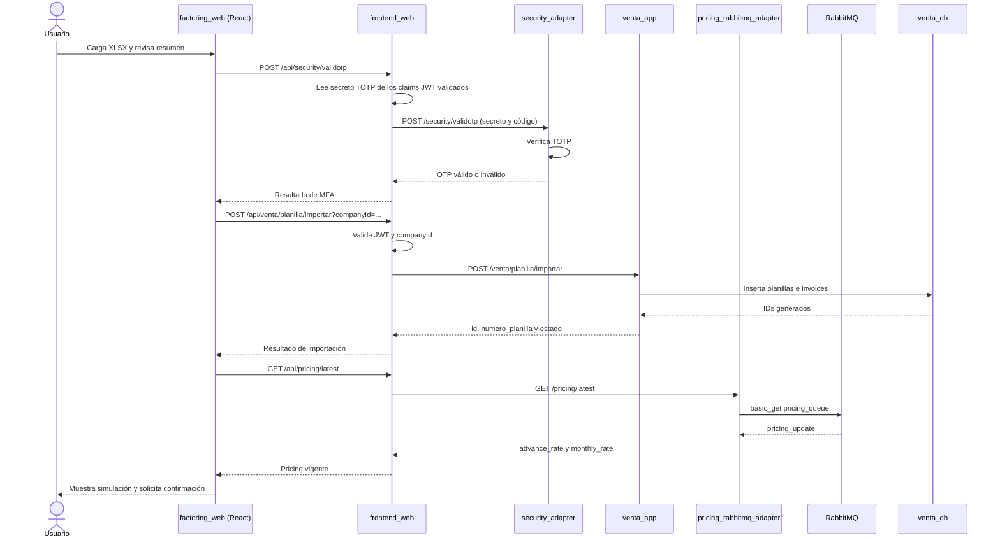
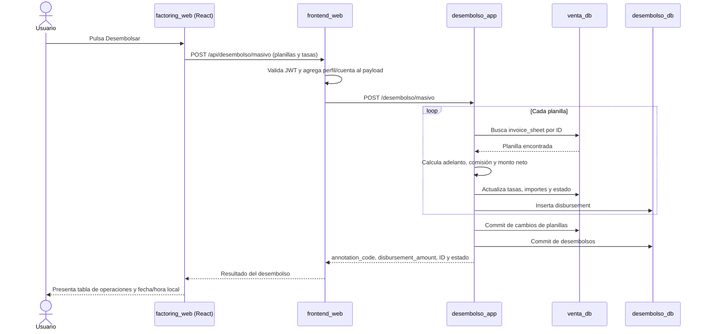
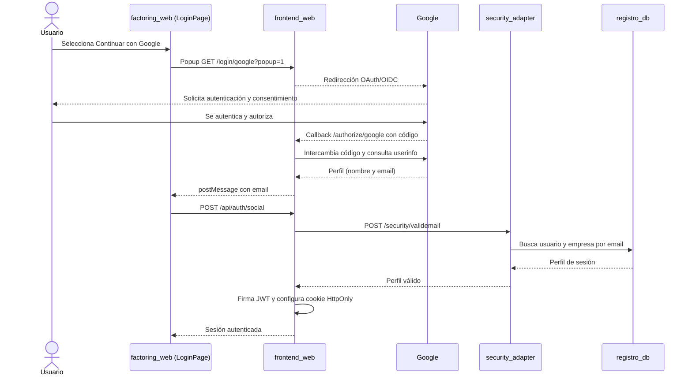
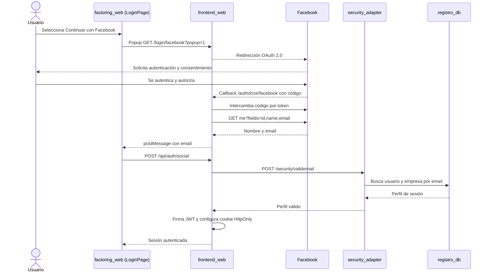

# Factoring distribuido

Aplicación de factoring organizada en servicios distribuidos por contexto de
negocio: Registro, Venta y Desembolso. El sistema combina APIs Flask,
PostgreSQL por caso de uso, una interfaz React, autenticación OAuth/MFA,
RabbitMQ para pricing y Kafka para eventos de notificación.

> **Alcance real de Docker Compose:** `factoring_project/docker-compose.yml`
> levanta los servicios descritos en esta guía. Los adaptadores
> `pricing_internal_adapter`, `pricing_external_adapter` y
> `notification_adapter` están en el repositorio, pero no forman parte de ese
> Compose. El flujo del sitio web utiliza el publisher y el lector RabbitMQ, y
> el adaptador HTTP de notificaciones Kafka.

## Índice

1. [Casos de uso](#casos-de-uso)
2. [Infraestructura](#infraestructura)
3. [Arquitectura general](#arquitectura-general)
4. [Diagramas de secuencia](#diagramas-de-secuencia)
   - [Registro](#registro)
   - [Venta y negociación](#venta-y-negociación)
   - [Desembolso masivo](#desembolso-masivo)
5. [Login con Google](#login-con-google)
6. [Login con Facebook](#login-con-facebook)
7. [MFA con Google Authenticator y código QR](#mfa-con-google-authenticator-y-código-qr)
8. [Bases de datos distribuidas por caso de uso](#bases-de-datos-distribuidas-por-caso-de-uso)
9. [Aplicaciones distribuidas por caso de uso](#aplicaciones-distribuidas-por-caso-de-uso)
10. [Módulo de Seguridad](#módulo-de-seguridad)
11. [Frontend `factoring_web`](#frontend-factoring_web)
12. [Pricing y RabbitMQ](#pricing-y-rabbitmq)
13. [Estructura del proyecto](#estructura-del-proyecto)
14. [Ejecución y pruebas](#ejecución-y-pruebas)
15. [Configuración y seguridad](#configuración-y-seguridad)

## Casos de uso

### Registro

El usuario inicia el registro con Google o Facebook para precargar su nombre y
correo. Luego completa los datos del representante legal y de la empresa.
`frontend_web` genera el secreto TOTP y un código QR, cifra la contraseña antes
de enviarla y coordina las APIs del contexto Registro:

- `POST /api/registro/usuario`: endpoint de fachada del frontend. Devuelve el
  identificador del usuario, el secreto TOTP y la imagen QR.
- `POST /api/registro/empresa`: valida el RUC mediante SUNAT antes de delegar
  la persistencia.
- `POST /registro/documento`: endpoint de `registro_app` para metadatos de
  documentos de empresa.

La persistencia de usuarios, empresas y documentos corresponde a
`registro_db`.

### Venta y negociación de facturas

La interfaz permite cargar una planilla Excel `.xlsx`, agrupar sus facturas y
presentar totales por planilla. El wizard verifica un código TOTP, importa las
planillas y sus facturas, consulta pricing y permite confirmar el desembolso.

Endpoints principales:

| Método | Endpoint | Servicio | Función |
| --- | --- | --- | --- |
| `POST` | `/api/security/validotp` | `frontend_web` | Valida el OTP de la sesión. |
| `POST` | `/api/venta/planilla/importar?companyId={id}` | `frontend_web` | Proxy autenticado para importar planillas y facturas. |
| `POST` | `/venta/planilla/importar?companyId={id}` | `venta_app` | Persiste planillas y facturas; devuelve `id` y `numero_planilla`. |
| `GET` | `/api/pricing/latest` | `frontend_web` | Proxy autenticado para consultar pricing desde RabbitMQ. |
| `POST` | `/api/desembolso/masivo` | `frontend_web` | Completa los datos de usuario y banco desde el JWT y delega el desembolso. |
| `POST` | `/desembolso/masivo` | `desembolso_app` | Actualiza la planilla en `venta_db` y registra el desembolso en `desembolso_db`. |
| `GET` | `/api/venta/planillas?company_id={id}` | `frontend_web` | Consulta las solicitudes de la empresa para la bandeja. |
| `GET` | `/venta/planillas?company_id={id}&status={estado}` | `venta_app` | Devuelve las facturas de las planillas; `status` es opcional. |

El endpoint `/venta/planilla` también permite registrar una planilla con
cálculo de pricing directamente en `venta_app`; es distinto del flujo actual
de importación masiva del wizard.

### Desembolso

Hay dos rutas de desembolso diferenciadas:

- **Masiva (`/desembolso/masivo`)**: procesa cada planilla, calcula adelanto,
  comisión y monto neto, marca la planilla como desembolsada y registra el
  resultado en `disbursements`. Este es el endpoint consumido por el wizard.
- **Individual (`/desembolso`)**: valida la empresa con SUNAT, solicita una
  transferencia a `bank_service`, registra el desembolso y publica eventos de
  notificación mediante Kafka.

El caso de uso masivo actualiza datos en dos bases distintas; no participa de
la llamada a banco ni de la publicación de notificaciones del caso individual.

## Infraestructura

La infraestructura local está definida en
[docker-compose.yml](./factoring_project/docker-compose.yml). Los puertos de
la tabla son los publicados en el host:

| Servicio | Contenedor Compose | Puerto | Responsabilidad |
| --- | --- | ---: | --- |
| Aplicación web | `factoring_web` | `7001` | Sirve la SPA compilada con Nginx y reenvía `/api/`. |
| Fachada, sesión y OAuth | `frontend_web` | `7000` | APIs web, OAuth, JWT, MFA y proxies a los servicios. |
| Registro | `registro_app` | `5001` | API del contexto de Registro. |
| Venta | `venta_app` | `5002` | Importación y consulta de planillas/facturas. |
| Desembolso | `desembolso_app` | `5003` | Desembolso individual y masivo. |
| PostgreSQL de Registro | `registro_db` | `5433` | Usuarios, empresas y documentos. |
| PostgreSQL de Venta | `venta_db` | `5434` | Planillas, facturas y ventas. |
| PostgreSQL de Desembolso | `desembolso_db` | `5435` | Desembolsos. |
| SUNAT simulado | `sunat_service` | `6000` | Validación de empresas y facturas. |
| Banco simulado | `bank_service` | `6300` | Respuesta de transferencia bancaria. |
| RabbitMQ | `rabbitmq` | `5672`, `15672` | Broker AMQP y consola de administración. |
| Lector de pricing | `pricing_rabbitmq_adapter` | `6400` | API HTTP para extraer un mensaje de pricing de la cola. |
| Publicador de pricing | `pricing_publisher_adapter` | `6410` | Publica eventos de pricing periódicamente. |
| Zookeeper | `zookeeper` | `2181` | Coordinación de Kafka. |
| Kafka | `kafka` | `9092` | Broker de eventos de notificación. |
| Adaptador de notificaciones | `notification_kafka_adapter` | `6500` | Recibe solicitudes HTTP y las publica en Kafka. |
| Kafka UI | `kafka-ui` | `8081` | Interfaz de observación local de Kafka. |
| pgAdmin | `pgadmin` | `8080` | Administración de las bases PostgreSQL. |

Los servicios se comunican entre sí mediante nombres DNS de Compose (por
ejemplo, `venta_app:5002`). La SPA usa el mismo origen del navegador: Nginx
sirve la aplicación por `7001` y enruta las llamadas `/api/` a
`frontend_web:7000`.

## Arquitectura general



## Diagramas de secuencia

### Registro

El acceso social se usa para obtener el nombre y correo que completan el
formulario de registro. El QR se genera durante la creación del usuario; la
empresa se crea después de completar el paso de datos empresariales.



### Venta y negociación

El wizard importa la planilla y sus facturas después de validar el OTP.
`venta_app` devuelve los identificadores de planilla que luego se envían al
caso de uso masivo de Desembolso.



### Desembolso masivo

El proxy web obtiene los datos de cliente y cuenta bancaria del JWT
`jwt_factoring`; el navegador envía las planillas importadas, sus totales y las
tasas de pricing.



El flujo individual es diferente: `POST /desembolso` valida empresa en SUNAT,
solicita transferencia a `bank_service`, persiste el resultado y envía eventos
de email/SMS al adaptador Kafka. No debe confundirse con el recorrido masivo
descrito arriba.

## Login con Google

En la SPA, el login social abre una ventana emergente a `frontend_web`. Authlib
completa OAuth/OpenID Connect; al callback exitoso, la ventana emergente envía
el correo a la SPA mediante `postMessage`. La SPA solicita
`POST /api/auth/social`; el backend comprueba que el email corresponda a un
perfil en `registro_db` mediante `security_adapter` y firma la cookie
`HttpOnly` `jwt_factoring`.



La ruta `/api/auth/social` valida el email registrado y crea una sesión; a
diferencia del inicio de sesión con contraseña, el código actual no solicita
un OTP en esa ruta.

## Login con Facebook

El recorrido es equivalente al de Google, pero usa OAuth 2.0 y consulta el
perfil con Graph API (`me?fields=id,name,email`).



Facebook/Google aportan identidad social; la cuenta debe existir y tener una
empresa asociada en el sistema para que `security_adapter` devuelva un perfil.

## MFA con Google Authenticator y código QR

Durante el registro, `frontend_web` crea un secreto TOTP con `pyotp`, genera
una URI `otpauth://` y la convierte en una imagen QR usando `qrcode`. La
interfaz muestra el QR para vincular la cuenta en Google Authenticator. El
secreto se registra como `verification_status` en `users` y se incluye en los
claims del JWT de sesión.

Al iniciar sesión con correo y contraseña:

1. La SPA envía correo, contraseña y código de seis dígitos a
   `POST /api/auth/credentials`.
2. `frontend_web` consulta `POST /security/validuser` en `security_adapter`.
3. `security_adapter` lee el perfil desde `registro_db`, descifra la
   contraseña almacenada y compara las credenciales.
4. Si las credenciales son correctas, `frontend_web` envía el secreto TOTP y
   el código a `POST /security/validotp`.
5. `security_adapter` valida el código con `pyotp.TOTP.verify`.
6. Si es válido, `frontend_web` firma la cookie de sesión `jwt_factoring`.

El wizard de negociación también valida un OTP contra el secreto de la sesión
antes de importar planillas. En cambio, el login social actual valida email y
no ejecuta la validación TOTP: el comportamiento exacto depende del método de
login utilizado.

## Bases de datos distribuidas por caso de uso

Cada contexto tiene un PostgreSQL y un volumen Docker propios:

| Base de datos | Puerto host | Tablas principales | Propietario lógico |
| --- | ---: | --- | --- |
| `registro_db` | `5433` | `users`, `companies`, `company_documents` | Registro |
| `venta_db` | `5434` | `invoice_sheets`, `invoices`, `sales` | Venta |
| `desembolso_db` | `5435` | `disbursements` | Desembolso |

Los engines y sesiones están definidos en
[db_config.py](./factoring_project/factoring_app/infrastructure/db_config.py).
Las variables son `REGISTRO_DATABASE_URL`, `VENTA_DATABASE_URL` y
`DESEMBOLSO_DATABASE_URL`. Las tres aplicaciones comparten el código de
entidades, pero `init_registro_db`, `init_venta_db` e `init_desembolso_db`
crean en cada base únicamente las tablas de su contexto.

Las relaciones foráneas se mantienen dentro de cada base (por ejemplo,
`invoices.sheet_id` referencia una planilla en `venta_db`). Entre bases se
transportan identificadores como valores; no hay una transacción distribuida
ni claves foráneas entre PostgreSQL. El caso masivo de desembolso abre sesiones
separadas para Venta y Desembolso, por lo que sus commits no constituyen una
transacción atómica conjunta.

Los volúmenes son `registro_data`, `venta_data` y `desembolso_data`. Los
scripts SQL de inicialización están en `factoring_project/init-scripts/`.

## Aplicaciones distribuidas por caso de uso

Las APIs de Registro, Venta y Desembolso usan
[factoring_app/Dockerfile](./factoring_project/factoring_app/Dockerfile) con
distintos módulos de arranque:

| Aplicación | Entry point | Puerto | Base de datos / función |
| --- | --- | ---: | --- |
| `registro_app` | `python -m factoring_app.registro_main` | `5001` | `registro_db`; usuario, empresa y documentos. |
| `venta_app` | `python -m factoring_app.venta_main` | `5002` | `venta_db`; planillas, facturas, consulta y pricing para el endpoint de venta directa. |
| `desembolso_app` | `python -m factoring_app.desembolso_main` | `5003` | `desembolso_db`; registra desembolsos y, en el caso masivo, actualiza planillas de `venta_db`. |

Además, `frontend_web` es una fachada Flask para los flujos del navegador,
sesiones y llamadas a servicios. Los adaptadores de SUNAT, banco, pricing y
Kafka tienen procesos separados en Compose.

## Módulo de Seguridad

`security_adapter` expone endpoints internos en el puerto `6600`:

| Endpoint | Uso |
| --- | --- |
| `POST /security/validuser` | Recupera perfil y empresa, descifra el password y valida las credenciales. |
| `POST /security/validemail` | Recupera perfil y empresa para el login social. |
| `POST /security/validotp` | Valida el código TOTP. |

El adaptador consulta `registro_db` mediante `REGISTRO_DATABASE_URL`. El
frontend no entrega la cookie JWT al adaptador: consulta estos endpoints y,
tras autenticar, firma `jwt_factoring` con `SECRET_KEY`. La cookie es
`HttpOnly`, `SameSite=Lax` y tiene vigencia de diez minutos; la API de sesión
renueva su expiración cuando el dashboard valida o actualiza la sesión.

Las rutas web protegidas validan los claims antes de delegar tareas. El proxy
de desembolso masivo construye la identidad, compañía, teléfono, datos de
banco, moneda y correo desde claims validados; esos campos no se confían al
cuerpo enviado por el navegador.

## Frontend `factoring_web`

`factoring_web` es una SPA React/TypeScript compilada con Vite y servida por
Nginx. Compose publica el contenedor en `http://localhost:7001`. El archivo
[nginx.conf](./factoring_project/factoring_web/nginx.conf) entrega los assets
estáticos y reenvía `/api/*` al contenedor `frontend_web:7000`.

Pantallas principales:

- `LoginPage.tsx`: login con correo/contraseña/OTP y ventanas emergentes de
  Google o Facebook.
- `RegisterPage.tsx`: registro social, representante legal, empresa y
  presentación del QR MFA.
- `DashboardPage.tsx`: consulta de solicitudes y wizard de negociación con
  carga Excel, importación, pricing, desembolso masivo y tabla de resultados.

La cookie de sesión es `HttpOnly`; el JavaScript no lee el JWT. Las solicitudes
al backend se hacen en el mismo origen pasando por el proxy Nginx.

## Pricing y RabbitMQ

Compose inicia RabbitMQ, `pricing_publisher_adapter` y
`pricing_rabbitmq_adapter`. El publisher genera cada 30 segundos un evento
`pricing_update` con `advance_rate`, `monthly_rate` y `timestamp`, y lo publica
como mensaje persistente en la cola durable `pricing_queue`.

El adaptador lector expone `GET /pricing/latest`. Al atenderlo, declara la
cola si es necesario y ejecuta `basic_get` con `auto_ack=True`; devuelve el
mensaje disponible y lo confirma al leerlo. Por ello, es una lectura de un
mensaje pendiente (no una consulta a un almacén histórico que garantice
obtener siempre el evento más reciente); el mensaje leído deja de estar
disponible para futuras consultas.

`frontend_web` usa esa API durante el paso Pricing del wizard y presenta las
tasas al usuario. El endpoint directo `POST /venta/planilla` obtiene también
el pricing del adaptador para calcular los importes de esa operación. Los
adaptadores alternativos `pricing_internal_adapter` y
`pricing_external_adapter` no están incluidos en el Compose actual.

El broker incluye la consola de administración en
<http://localhost:15672>; las credenciales de desarrollo se configuran en
Compose y deben cambiarse antes de un despliegue real.

## Estructura del proyecto

```text
.
├── README.md
└── factoring_project/
    ├── docker-compose.yml
    ├── requirements.txt
    ├── requirements-test.txt
    ├── factoring_app/
    │   ├── registro_main.py
    │   ├── venta_main.py
    │   ├── desembolso_main.py
    │   ├── application/          # Casos de uso
    │   ├── domain/               # Entidades y puertos
    │   ├── infrastructure/      # DB, repositorios e integraciones
    │   └── interface/            # APIs Flask por caso de uso
    ├── factoring_web/
    │   ├── src/                  # SPA React/TypeScript
    │   ├── public/
    │   ├── Dockerfile
    │   └── nginx.conf
    ├── frontend_web/
    │   ├── app.py                # OAuth, JWT, MFA y proxies HTTP
    │   ├── templates/
    │   └── requirements.txt
    ├── security_adapter/
    ├── FigmaFactoringWeb/        # Prototipo/diseño; no se ejecuta en Compose
    ├── sunat_adapter/
    ├── bank_adapter/
    ├── pricing_publisher_adapter/
    ├── pricing_rabbitmq_adapter/
    ├── pricing_internal_adapter/ # No iniciado por el Compose actual
    ├── pricing_external_adapter/ # No iniciado por el Compose actual
    ├── notification_kafka_adapter/
    ├── notification_adapter/     # No iniciado por el Compose actual
    ├── init-scripts/
    │   ├── registro/init.sql
    │   ├── venta/init.sql
    │   └── desembolso/init.sql
    └── tests/
```

## Ejecución y pruebas

Desde la raíz del repositorio, iniciar todos los servicios:

```bash
docker compose -f factoring_project/docker-compose.yml up --build
```

URLs locales principales:

- Aplicación web: <http://localhost:7001>
- Fachada Flask/API OAuth: <http://localhost:7000>
- RabbitMQ Management: <http://localhost:15672>
- Kafka UI: <http://localhost:8081>
- pgAdmin: <http://localhost:8080>

Ejecutar las pruebas Python desde la raíz:

```bash
python -m pytest -q factoring_project/tests
```

Validar la configuración de Compose:

```bash
docker compose -f factoring_project/docker-compose.yml config --quiet
```

Detener los servicios:

```bash
docker compose -f factoring_project/docker-compose.yml down
```

`docker compose down -v` elimina también los volúmenes PostgreSQL y sus datos;
utilizarlo solo cuando se quiera borrar el estado local.

## Configuración y seguridad

- Configurar las credenciales OAuth de Google y Facebook y registrar los
  callback URLs correctos para el entorno.
- Gestionar `SECRET_KEY`, secretos OAuth, claves de base de datos y claves de
  RabbitMQ desde variables/secretos del entorno; no usar valores de desarrollo
  en producción.
- Reemplazar las credenciales de ejemplo y asegurar los puertos antes de
  exponer los servicios fuera de la red local.
- Usar HTTPS y callbacks OAuth seguros en producción.
- Proteger el secreto TOTP y la clave usada para cifrar las contraseñas; rotar
  los secretos si alguno fue expuesto.
- El perfil y los identificadores usados por los proxies se obtienen de la
  sesión validada en el servidor. No se debe confiar en datos de identidad
  enviados por el cliente.
