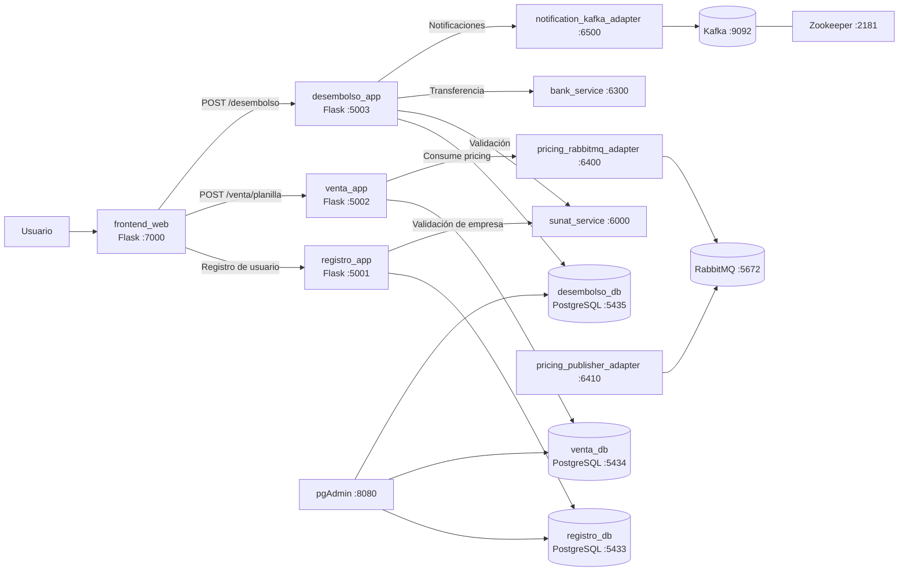
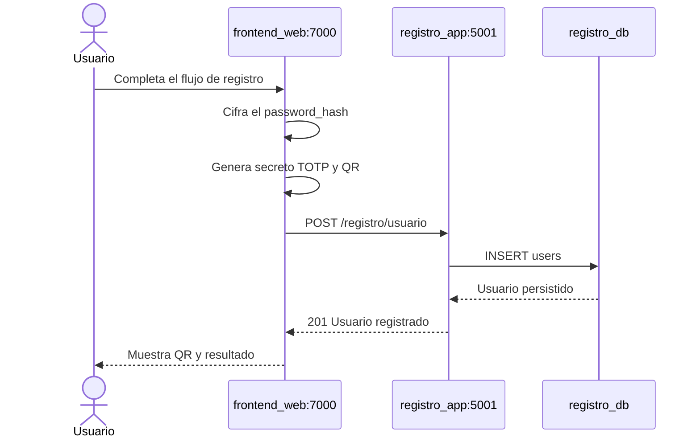
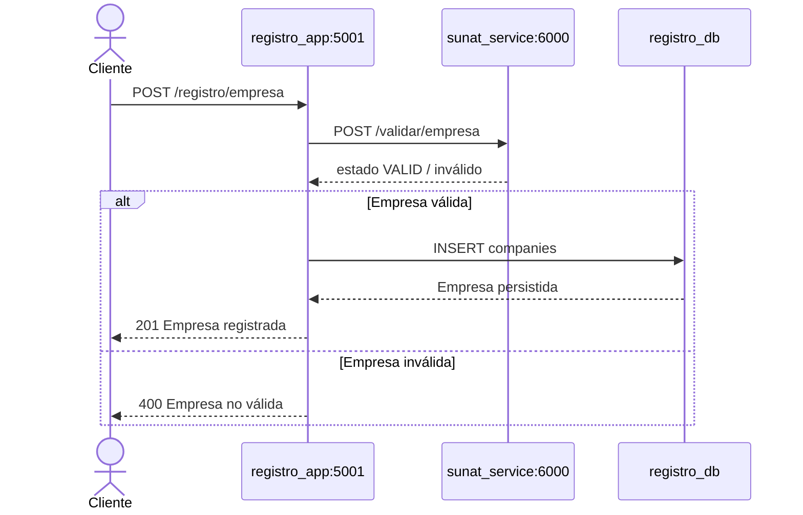
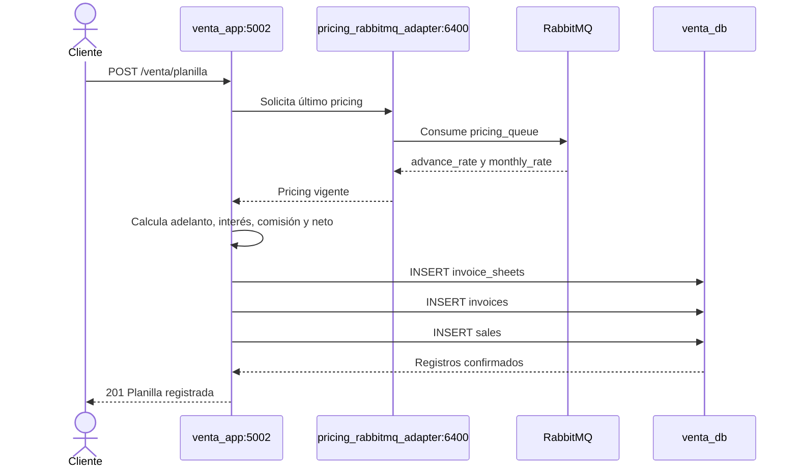
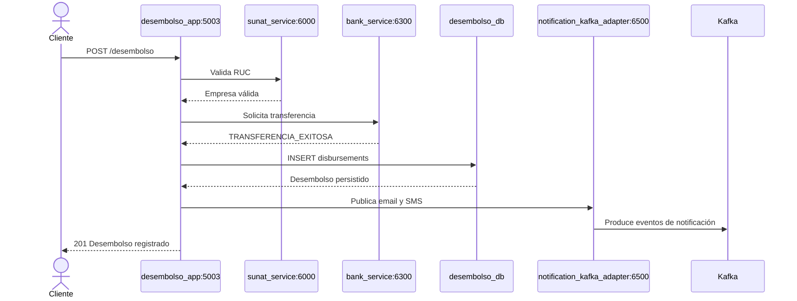
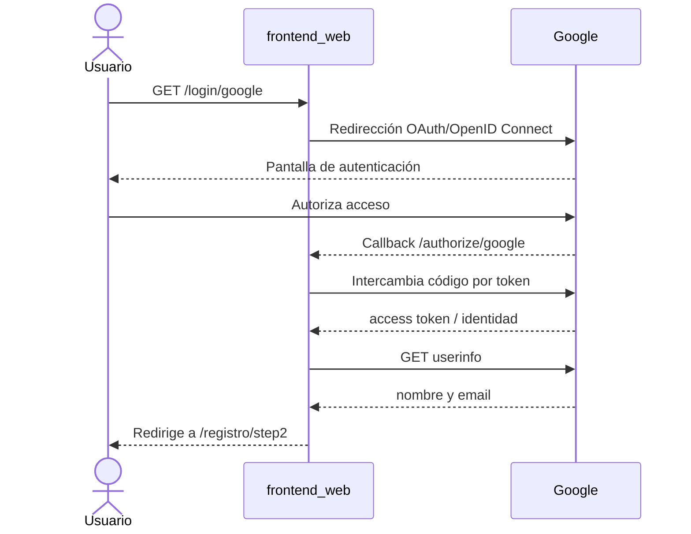
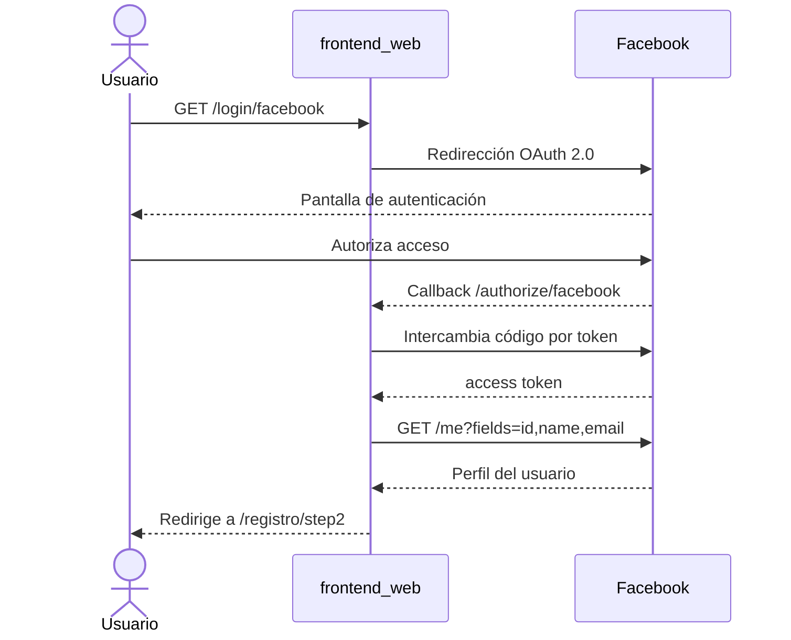
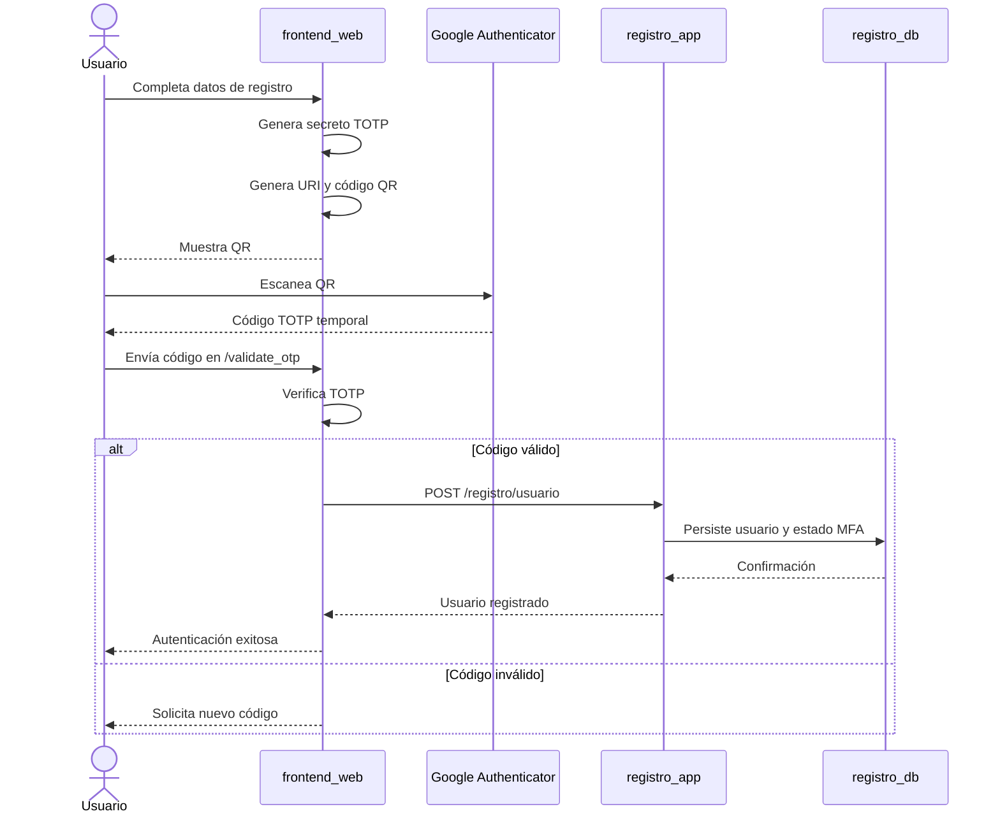

# Proyecto Factoring Distribuido

Aplicación web de factoring implementada con una arquitectura distribuida por
caso de uso. Cada contexto de negocio tiene su propia aplicación Flask y su
propia base de datos PostgreSQL:

- **Registro**: usuarios, empresas y documentos.
- **Venta**: planillas, facturas, cálculo de pricing y ventas.
- **Desembolso**: transferencias y registro de desembolsos.

El sistema también integra proveedores externos, RabbitMQ para pricing, Kafka
para notificaciones y un frontend web con autenticación social y MFA.

## Índice

1. [Casos de uso](#casos-de-uso)
2. [Infraestructura](#infraestructura)
3. [Arquitectura general](#arquitectura-general)
4. [Diagramas de secuencia](#diagramas-de-secuencia)
5. [Login con Google](#login-con-google)
6. [Login con Facebook](#login-con-facebook)
7. [MFA con Google Authenticator y QR](#mfa-con-google-authenticator-y-qr)
8. [Bases de datos distribuidas](#bases-de-datos-distribuidas)
9. [Aplicaciones distribuidas](#aplicaciones-distribuidas)
10. [Estructura del proyecto](#estructura-del-proyecto)
11. [Ejecución](#ejecución)
12. [Configuración y seguridad](#configuración-y-seguridad)

## Casos de uso

### Registro

La aplicación `registro_app` expone el contexto de Registro en el puerto
`5001` y utiliza exclusivamente `registro_db`.

Endpoints:

| Método | Endpoint | Descripción |
| --- | --- | --- |
| `POST` | `/registro/usuario` | Registra un usuario |
| `POST` | `/registro/empresa` | Valida la empresa con SUNAT y la registra |
| `POST` | `/registro/documento` | Registra un documento de empresa |

Las tablas de este contexto son `users`, `companies` y
`company_documents`.

### Venta

La aplicación `venta_app` expone el contexto de Venta en el puerto `5002` y
utiliza `venta_db`.

Endpoint:

| Método | Endpoint | Descripción |
| --- | --- | --- |
| `POST` | `/venta/planilla` | Obtiene pricing, calcula importes y registra una planilla con sus facturas |
| `GET` | `/venta/planillas?company_id={id}&status={status}` | Consulta planillas y facturas de una empresa; `status` es opcional y devuelve `404` si no hay resultados |

El pricing se obtiene desde RabbitMQ. Las tablas principales son
`invoice_sheets`, `invoices` y `sales`.

### Desembolso

La aplicación `desembolso_app` expone el contexto de Desembolso en el puerto
`5003` y utiliza `desembolso_db`.

Endpoint:

| Método | Endpoint | Descripción |
| --- | --- | --- |
| `POST` | `/desembolso` | Valida la empresa, ejecuta la transferencia y registra el desembolso |

El caso de uso utiliza `sunat_service`, `bank_service` y publica
notificaciones mediante `notification_kafka_adapter`. La tabla de este
contexto es `disbursements`.

## Infraestructura

La infraestructura se levanta con
[docker-compose.yml](./factoring_project/docker-compose.yml).

| Componente | Contenedor | Puerto | Responsabilidad |
| --- | --- | ---: | --- |
| Frontend | `frontend_web` | `7000` | Flujo web, OAuth y MFA |
| Registro | `registro_app` | `5001` | API del caso de uso Registro |
| Venta | `venta_app` | `5002` | API del caso de uso Venta |
| Desembolso | `desembolso_app` | `5003` | API del caso de uso Desembolso |
| PostgreSQL Registro | `registro_db` | `5433` | Persistencia de Registro |
| PostgreSQL Venta | `venta_db` | `5434` | Persistencia de Venta |
| PostgreSQL Desembolso | `desembolso_db` | `5435` | Persistencia de Desembolso |
| SUNAT | `sunat_service` | `6000` | Validación de empresas |
| Banco | `bank_service` | `6300` | Ejecución de transferencias |
| RabbitMQ | `rabbitmq` | `5672`, `15672` | Mensajería y administración |
| Pricing consumer | `pricing_rabbitmq_adapter` | `6400` | Lectura del pricing |
| Pricing publisher | `pricing_publisher_adapter` | `6410` | Publicación de pricing |
| Zookeeper | `zookeeper` | `2181` | Coordinación de Kafka |
| Kafka | `kafka` | `9092` | Eventos y notificaciones |
| Kafka UI | `kafka-ui` | `8081` | Observabilidad de Kafka |
| Notificaciones | `notification_kafka_adapter` | `6500` | Publicación de notificaciones |
| pgAdmin | `pgadmin` | `8080` | Administración de PostgreSQL |

### Arquitectura general



Los servicios se comunican por el nombre del contenedor dentro de la red de
Docker Compose. Los puertos publicados permiten acceder desde el equipo
host.

## Diagramas de secuencia

### Registro de usuario



### Registro de empresa



### Venta de planilla



### Desembolso



## Login con Google

El frontend utiliza OAuth 2.0/OpenID Connect mediante Authlib. Google
autentica al usuario y devuelve el perfil al callback del frontend; las
credenciales OAuth no se procesan en `registro_app`.

Pasos:

1. El usuario selecciona Google en `/login/google`.
2. `frontend_web` genera la URL de autorización y redirige al usuario a Google.
3. Google autentica al usuario y redirige a `/authorize/google`.
4. El frontend intercambia el código por un token.
5. El frontend consulta `userinfo` de Google.
6. Se guardan temporalmente `full_name` y `email` en el flujo de registro.
7. El usuario continúa con DNI, teléfono, contraseña y MFA.



## Login con Facebook

El flujo de Facebook utiliza OAuth 2.0 mediante Authlib. El perfil se
consulta con el endpoint `me?fields=id,name,email`.

Pasos:

1. El usuario selecciona Facebook en `/login/facebook`.
2. `frontend_web` redirige a Facebook.
3. Facebook autentica al usuario y devuelve el callback
   `/authorize/facebook`.
4. El frontend obtiene el token de acceso.
5. El frontend consulta nombre, correo e identificador mediante Graph API.
6. El flujo continúa en `/registro/step2`.



## MFA con Google Authenticator y QR

El MFA se implementa con TOTP mediante `pyotp`:

1. Después del login social, el usuario completa DNI, teléfono y contraseña.
2. En el paso 3, el frontend genera un secreto TOTP aleatorio.
3. Se crea una URI `otpauth://` con el correo del usuario y el emisor
   `FactoringApp`.
4. La URI se convierte en una imagen QR con `qrcode`.
5. El usuario escanea el QR con Google Authenticator.
6. La aplicación móvil empieza a generar códigos temporales.
7. El usuario introduce el código en `/validate_otp`.
8. El frontend valida el código con `pyotp.TOTP.verify`.
9. Si el código es válido, se genera un identificador de sesión del flujo.

El secreto TOTP se envía al backend como `verification_status` durante el
registro. En un entorno productivo debe almacenarse cifrado, no exponerse en
logs y protegerse con una clave administrada externamente.



## Bases de datos distribuidas

La persistencia está particionada por caso de uso:

| Base de datos | Puerto host | Tablas principales | Aplicación |
| --- | ---: | --- | --- |
| `registro_db` | `5433` | `users`, `companies`, `company_documents` | `registro_app` |
| `venta_db` | `5434` | `invoice_sheets`, `invoices`, `sales` | `venta_app` |
| `desembolso_db` | `5435` | `disbursements` | `desembolso_app` |

La configuración se encuentra en
[db_config.py](./factoring_project/factoring_app/infrastructure/db_config.py):

- `REGISTRO_DATABASE_URL`
- `VENTA_DATABASE_URL`
- `DESEMBOLSO_DATABASE_URL`

Cada aplicación crea su propio engine y `sessionmaker`. Las entidades de un
contexto no se consultan mediante una sesión de otro contexto.

Los identificadores que cruzan límites, como `company_id` y `sheet_id`, se
transportan como datos del mensaje. No se utilizan claves foráneas entre
bases de datos distintas. Las relaciones internas de cada base sí mantienen
sus claves foráneas locales.

Cada PostgreSQL tiene un volumen independiente:

- `registro_data`
- `venta_data`
- `desembolso_data`

## Aplicaciones distribuidas

Las tres aplicaciones se construyen desde el mismo
[Dockerfile](./factoring_project/factoring_app/Dockerfile), pero arrancan con
entrypoints distintos:

| Servicio | Entry point | Puerto | Sesión |
| --- | --- | ---: | --- |
| `registro_app` | `python -m factoring_app.registro_main` | `5001` | `RegistroSessionLocal` |
| `venta_app` | `python -m factoring_app.venta_main` | `5002` | `VentaSessionLocal` |
| `desembolso_app` | `python -m factoring_app.desembolso_main` | `5003` | `DesembolsoSessionLocal` |

La separación permite desplegar, escalar y reiniciar cada caso de uso de
forma independiente. El frontend conoce la URL de Registro mediante
`REGISTRO_APP_URL`, cuyo valor en Compose es:

```text
http://registro_app:5001
```

## Estructura del proyecto

```text
.
├── README.md
└── factoring_project/
    ├── docker-compose.yml
    ├── requirements.txt
    ├── factoring_app/
    │   ├── Dockerfile
    │   ├── registro_main.py
    │   ├── venta_main.py
    │   ├── desembolso_main.py
    │   ├── application/
    │   │   ├── desembolso_use_cases.py
    │   │   ├── registro_use_cases.py
    │   │   └── venta_use_cases.py
    │   ├── domain/
    │   │   ├── entities.py
    │   │   └── ports.py
    │   ├── infrastructure/
    │   │   ├── db_config.py
    │   │   └── repositories.py
    │   └── interface/
    │       ├── registro_app.py
    │       ├── venta_app.py
    │       └── desembolso_app.py
    ├── frontend_web/
    │   ├── app.py
    │   ├── Dockerfile
    │   ├── requirements.txt
    │   ├── static/
    │   └── templates/
    ├── init-scripts/
    │   ├── registro/init.sql
    │   ├── venta/init.sql
    │   └── desembolso/init.sql
    ├── bank_adapter/
    ├── sunat_adapter/
    ├── pricing_rabbitmq_adapter/
    ├── pricing_publisher_adapter/
    ├── notification_kafka_adapter/
    └── tests/
```

## Ejecución

Desde la raíz del repositorio:

```bash
docker compose -f factoring_project/docker-compose.yml up --build
```

URLs útiles:

- Frontend: <http://localhost:7000>
- Registro: <http://localhost:5001>
- Venta: <http://localhost:5002>
- Desembolso: <http://localhost:5003>
- pgAdmin: <http://localhost:8080>
- RabbitMQ Management: <http://localhost:15672>
- Kafka UI: <http://localhost:8081>

Para detener los contenedores:

```bash
docker compose -f factoring_project/docker-compose.yml down
```

Para detenerlos y eliminar también los volúmenes de datos locales:

```bash
docker compose -f factoring_project/docker-compose.yml down -v
```

## Configuración y seguridad

- Sustituir los valores OAuth de ejemplo por credenciales propias de Google y
  Facebook.
- No almacenar secretos OAuth, claves de sesión ni contraseñas directamente
  en el repositorio.
- Usar un archivo `.env` local o un gestor de secretos en despliegues reales.
- Cambiar las credenciales por defecto de PostgreSQL, pgAdmin y RabbitMQ.
- Usar HTTPS para el frontend y los callbacks OAuth en producción.
- Proteger el secreto TOTP y evitar enviarlo o imprimirlo en texto plano.
- Configurar `REGISTRO_APP_URL` según el entorno:
  - Docker Compose: `http://registro_app:5001`
  - Ejecución local: `http://localhost:5001`

## Pruebas

Las pruebas se encuentran en
[factoring_project/tests](./factoring_project/tests).

```bash
python -m pytest -q factoring_project/tests
```

También se puede validar la configuración de Compose:

```bash
docker compose -f factoring_project/docker-compose.yml config --quiet
```
